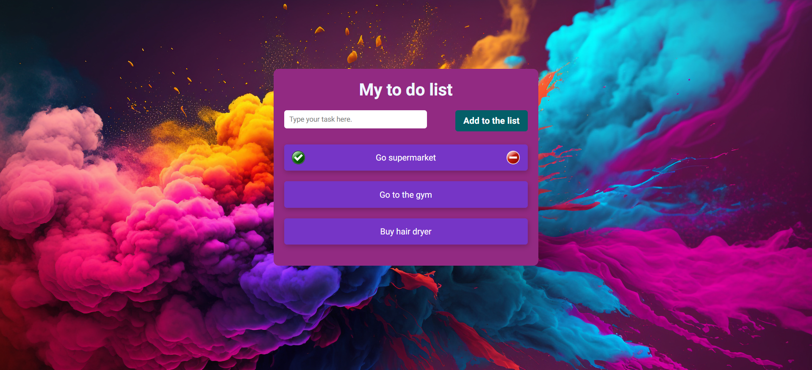

# To-Do List Website



This is a simple web application that allows users to create a to-do list on a website. Users can add new tasks, mark tasks as done, and delete tasks from the list.

## Features

- Add tasks to your to-do list.
- Mark tasks as done.
- Delete tasks from the list.

## JavaScript Features

### Input Validation

- The website includes input validation to prevent users from adding empty tasks.
- If a user attempts to add an empty task, an alert will prompt them to write something before adding a task.

### Persistent Data

- Your to-do list is persistent, meaning that even if you refresh the page, your tasks will not disappear.
- The website utilizes local storage to store and retrieve tasks, providing a seamless user experience.

### Dynamic Interactions

- **Add Item:** Click the "Add to the list" button to add a new task to the list.
- **Mark as Done:** Click the green tick icon next to a task to mark it as done. The task will be visually updated with a strikethrough.
- **Delete Item:** Click the red cross icon to delete a task from the list.

## Demo

[Live Demo](https://your-live-demo-link.com)

## Getting Started

### Prerequisites

- Web browser (Chrome, Firefox, Safari, etc.)

### Installation

1. Clone the repository:

   ```bash
   git clone https://github.com/jokasta29/todolist.git
   
   1. Open index.html in your preferred web browser.


## Contributing
Contributions are welcome! If you find any issues or have suggestions for improvements, please open an issue or create a pull request.

## License
This project is licensed under the MIT License.
